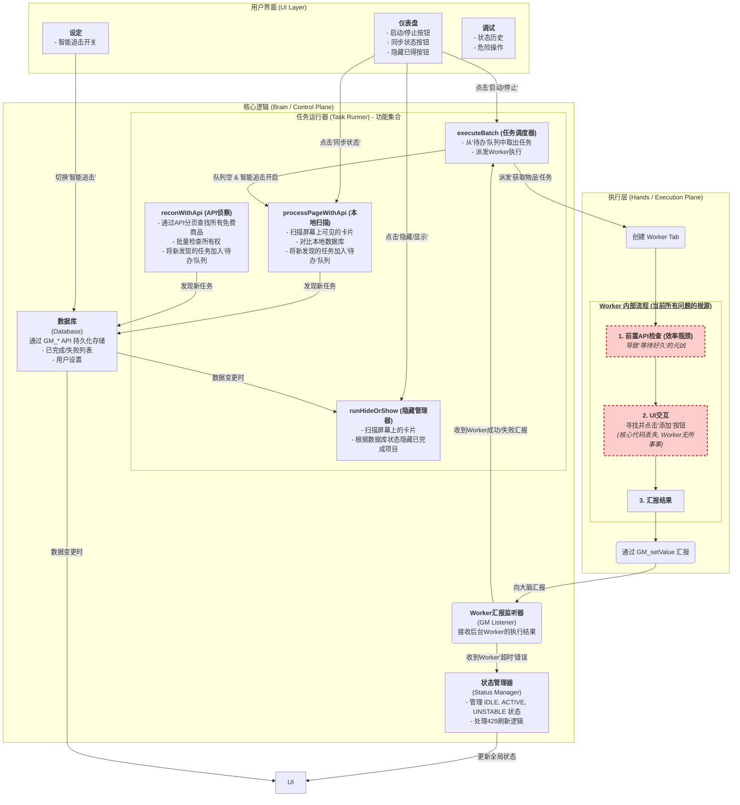

# Fab Helper 脚本完整架构图及问题诊断 (v1.3.0)

本文档旨在提供 Fab Helper 脚本当前版本 (`v1.3.0`) 的**完整**系统架构图和详细功能解读。此“蓝图”将毫无保留地展示脚本的**所有功能模块**、它们之间的复杂关系，并准确定位当前所有问题的**根本原因**。这是我们进行最终修复的共识基础。

---

## 核心设计思想

脚本的核心依然是“**大脑-工蜂 (Brain-Hands)**”分离模式，但其内部的复杂性远超之前所展示的。

-   **大脑 (主标签页)**: 唯一的控制中心，负责UI交互、状态管理、数据持久化，并发起所有类型的任务。
-   **工蜂 (Worker 标签页)**: 纯粹的执行单元，**只负责“获取物品”这一项具体工作**。

---

## 完整系统架构图

---

## 模块与功能完整解读

#### **1. 任务运行器 (Task Runner) - 四大核心功能**

这是脚本功能最集中的地方，包含了四个**相互独立**但又彼此关联的功能：

-   **本地扫描 (`processPageWithApi`)**:
    -   **触发**: 用户点击“同步状态”时；或者在“一键开刷”过程中，“智能追击”被激活时。
    -   **工作**: 只扫描**当前屏幕上可见**的商品，与本地数据库对比，快速将新发现的、未入库的商品加入“待办”队列。

-   **API侦察 (`reconWithApi`)**:
    -   **触发**: 用户在UI上手动点击“侦察”按钮时（*注：此按钮在近期版本中被移除，但功能依然存在*）。
    -   **工作**: 这是一个**深度扫描**功能。它会通过API，一页一页地请求Fab网站上**所有**的免费商品，进行批量所有权检查，并将所有未入库的商品加入“待办”队列。这是一个高强度、高消耗的操作。

-   **任务调度器 (`executeBatch`)**:
    -   **触发**: 用户点击“启动/停止”时。
    -   **工作**: 这是“一键开刷”功能的核心。它负责从“待办”队列中取出任务，并创建后台Worker标签页去执行。

-   **隐藏管理器 (`runHideOrShow`)**:
    -   **触发**: 用户点击“隐藏/显示”按钮时；或者当数据库中的“已完成”列表发生变化时。
    -   **工作**: 扫描屏幕上的商品，如果其ID存在于本地的“已完成”数据库中，就将其从页面上隐藏。

#### **2. Worker 内部流程 - 当前所有问题的“震中”**

如图中红色高亮所示，当前脚本的所有功能障碍，都汇集在这个最底层的执行单元上：

-   **病灶一：前置API检查 (效率瓶颈)**
    -   **问题**: Worker在执行任何操作前，都必须先联网进行一次所有权检查。
    -   **后果**: 直接导致了您所描述的“**新打开的商品网页，要等好久才会执行动作**”的问题。

-   **病灶二：UI交互代码丢失 (功能缺失)**
    -   **问题**: 在我之前的某次灾难性重构中，Worker内部用于**寻找并点击“添加到我的库”按钮的核心代码被错误地删除了**。
    -   **后果**: 这导致Worker实际上**无事可做**，无法为您添加入库任何新商品。这也是为什么您看到“**已入库的一直是 3030**”的根本原因。Worker只是打开了页面，超时失败，然后关闭，自始至终没有执行任何有效的点击操作。

---

## 结论：拨乱反正的唯一路径

这份完整的“X光片”告诉我们，无论上层逻辑（大脑）多么复杂，如果底层的执行单元（工蜂）是**残废**的，那么整个系统都将瘫痪。

因此，下一步的修复将无比专注，直击“震中”：

**我们将彻底重构“Worker 内部流程”，移除“前置API检查”，并恢复、优化其核心的“UI交互”代码，让它重新获得“点击按钮”的能力。**

这不仅会解决“等待好久”的问题，更会**让脚本的核心入库功能恢复正常**。

这，就是我们走向最终成功的、唯一且正确的道路。 