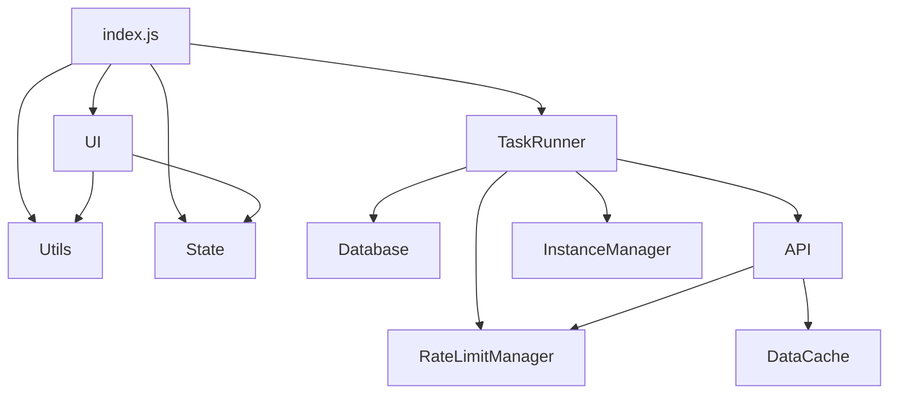

# Fab Helper 脚本架构设计

本文档介绍 Fab Helper 脚本的整体架构设计和核心模块。

## 整体架构

Fab Helper 脚本采用现代化的模块化设计（ES Modules），通过 esbuild 构建为单一的用户脚本。

## 项目结构

```
src/
├── index.js             # 入口文件 (初始化、全局事件)
├── config.js            # 全局配置 (常量、选择器)
├── state.js             # 集中状态管理 (State 对象)
├── i18n/                # 国际化资源 (en.js, zh.js)
└── modules/             # 功能模块
    ├── api.js           # API 请求封装
    ├── data-cache.js    # 数据缓存层
    ├── database.js      # 持久化存储 (GM_getValue wrapper)
    ├── instance-manager.js # 多标签页/实例管理
    ├── page-diagnostics.js # 页面诊断工具
    ├── page-patcher.js  # 页面修补与游标管理
    ├── rate-limit-manager.js # 限速检测与恢复
    ├── task-runner.js   # 任务调度与执行核心（旧路径）
    ├── ui.js            # 界面渲染与交互
    ├── utils.js         # 通用工具函数
    └── （新流水线，见下节）
        ├── event-log.js        # 事件日志：单一真相源
        ├── state-machine.js    # 六态任务状态机
        ├── rate-limiter.js     # 令牌桶（AIMD）
        ├── claim-strategy.js   # ApiClaim / DomClaim 双策略
        ├── listing-source.js   # /i/listings/search 分页枚举
        ├── pipeline.js         # 单标签页流水线编排
        ├── pipeline-adapter.js # 与真实页面/GM 存储对接
        ├── pipeline-scheduler.js # 调度策略（可脱离定时器测试）
        ├── detail-claim.js   # 详情页领取核心（新旧路径共用）
        └── iframe-claim.js   # 领取传输层：同源隐藏 iframe
```

## 核心模块架构



## 新一代流水线（API 优先架构，默认关闭）

旧链路是「滚动 DOM 骗页面发搜索请求 → 从卡片 DOM 里抠 uid → 开 7 个 worker 标签页
→ 每个标签加载完整详情页 → DOM 点击」。它把「并发」这个抽象安在了「开几个标签页」上，
而标签数只是请求速率的拙劣代理：后台标签被浏览器节流后两者彻底脱钩，为了维持住节流后的
标签，又必须引入 Worker 心跳、WebRTC 防冻结、卡死看门狗……

新架构换掉的是控制变量，不是写法：

| 关注点 | 旧实现 | 新实现 |
| --- | --- | --- |
| 枚举 | 滚动 DOM，靠哨兵是否触发来猜「是否到底」 | 直接调 `/i/listings/search`，由 `cursors.next === null` 权威判定 |
| 并发 | 7 个 worker 标签页 | 令牌桶按速率（次/分钟）节流，单标签页顺序推进 |
| 状态 | `todo` / `done` / `failed` 三份并行数组手工互清 | 事件日志（append-only），三份都是其派生视图 |
| 异常 | 四处互不知情的刷新兜底 | 统一收敛到 `RATE_LIMITED` 一条退避回路 |
| 领取 | DOM 自动化（class hash + 多语言文案匹配） | `ApiClaim` 主路径 + `DomClaim` 回落，用回落率监控 |

分层与职责：

- **event-log.js** —— 单一真相源。按规范 listing uid 追加不可变事件，
  `todo` / `done` / `failed` 全部是派生视图，「最新事件优先」。
  一致性由模型保证，而不是由调用点保证。
- **state-machine.js** —— `IDLE / SCANNING / CLAIMING / VERIFYING / RATE_LIMITED / DONE`
  六态。超时策略集中在一张表里；`refreshClock()` 供长时间暂停后恢复，
  避免把暂停时长算进超时判定。
- **rate-limiter.js** —— 令牌桶 + AIMD。收到 429 就按 `Retry-After` 暂停并把速率折半，
  连续成功则缓慢回到基准。
- **claim-strategy.js** —— `ApiClaim`（接口领取，端点待抓包确认）与
  `DomClaim`（回落，实现由外部注入）。`ClaimExecutor` 统计回落率，
  回落率长期为 1 即说明接口路径没接好。
- **listing-source.js** —— 分页枚举。**注意**：抓包样本里 4 个商品全部
  `startingPrice.price === 0`，但只有 2 个 `isFree === true`，因此 `isFree`
  看起来只标记 CC0 许可，绝不能作为唯一判据。默认用 `FLAG_OR_PRICE` 并集。
- **pipeline.js** —— 编排「一步做什么」。所有副作用通过 `deps` 注入，
  时间由调用方注入，因此整条流程可以在测试里同步跑完。
- **pipeline-adapter.js** —— 把上述模块接到真实环境：`GM_xmlhttpRequest` 网络层、
  `Database.isDone` 入库复查、事件日志的持久化与旧数据层回写。
- **pipeline-scheduler.js** —— 决定「多快做、做完了要不要再来一遍」。
  定时器与时钟全部注入，调度策略因此可测。
- **detail-claim.js** —— 详情页领取核心：在一个**已经停在商品详情页**的文档上
  完成单条领取（等就绪 → 接口复查 → 已拥有判定 → 选许可 → 点添加 → 等入库，
  期间积极寻找并点击结算按钮）。`document` / `window` / `Utils` / `API` /
  `TaskRunner` / 定时器全部可注入，因此这段原本只能靠线上观察的逻辑可以在 Node
  里用假 DOM 完整驱动。它只负责「把商品领到手」，**不负责**把页面送到详情页 ——
  那是调用方的事（worker 标签页 / iframe / 直接导航）。

调度器的三条硬约束（每条都对应旧实现的一个具体故障）：

1. **一轮到底后不自动重扫**。执行开关保持开启时若自动重扫，脚本会在几秒内把整份
   免费列表重新翻一遍，既无意义地反复请求接口，也放大被风控的概率。
   重新枚举需要满足其一：用户重新拨动过执行开关，或到了 `PIPELINE_RESCAN_INTERVAL_MS`。
2. **重新枚举保留事件历史**（`restart` 而非 `reset`）。历史里已 `CLAIMED` / `FAILED` /
   `SKIPPED` 的 uid 不会再次进入待领队列 —— 这是不重复领取的唯一保证。
3. **任何异常都必须换成退避时长**。吞掉异常后按 0 延迟继续调度，等于以最快速度
   反复猛打接口，一次偶发 429 会被自己打成持续风控。

### 开关与现状

- `Config.USE_API_PIPELINE`（默认 `false`）：打开后新流水线取代旧的滚动枚举与
  worker 领取路径。
- `Config.CLAIM_TRANSPORT`（默认 `'none'`）：用哪种传输层把详情页送到眼前。
  默认 `'none'` 时没有任何领取后端，流水线会拒绝启动并自动回退旧路径。
  配成 `'iframe'` 才启用同源 iframe 领取 —— **该路径尚未经过线上验证**，
  所以刻意不跟着总开关一起开：它一旦不工作，整份免费列表会被逐条标记成
  「领取失败」并在事件日志里定型，之后再修好也不会重试。
- `Config.PIPELINE_RESCAN_INTERVAL_MS`（默认 `0`）：一轮到底后的自动重扫间隔，
  0 表示不自动重扫。
- `hasClaimBackend()` 是启动前的安全闸门；接好任一路领取后端后，
  打开 `USE_API_PIPELINE` 即可切换，无需改动流程代码。
- 旧路径的护栏判的是 `isApiPipelineActive()`（开关**且**有领取后端），
  不是 `Config.USE_API_PIPELINE`。新流水线拒绝启动时旧路径必须继续干活，
  否则脚本整体停摆。

### 领取传输层

`detail-claim.js` 解决「页面已经在详情页时怎么领」，`iframe-claim.js` 解决
「怎么把页面送到详情页」。两条候选路线：

| 路线 | 现状 | 代价 |
| --- | --- | --- |
| `ApiClaim`（接口领取） | **端点未确认**：历史抓包里只有 GET 端点（`/i/listings/search`、 `/i/users/context`、`/i/users/me/wallet`、`/i/cart`、`/i/listings/prices-infos`、`/i/users/me/listings-states`），没有领取类 POST | 需要用户在 devtools 里抓一次真实的「免费领取」请求；一旦确认，`ApiClaim.configure({endpoint})` 即可接管，无需改流程 |
| `DomClaim`（DOM 领取） | **已实现**，默认关闭 | 同源 iframe：`www.fab.com` 返回 `x-frame-options: SAMEORIGIN`，父页面可读写 `contentDocument`。主标签页挂隐藏帧 → 跨文档驱动 → 领完摘帧，全程不开新标签页 |

iframe 路线有两个非显然的坑，都已处理：

1. **脚本会在帧内二次初始化**。userscript 默认注入所有同源帧，若不拦，实例管理 /
   UI / 任务派发 / 保活都会在帧里跑第二份，与主标签页抢占 active instance。
   解决：帧的 URL 带 `Config.CLAIM_FRAME_PARAM`，`main()` 在 `InstanceManager.init()`
   之前就识别并退出，连实例都不注册。
2. **帧不能 `display:none`**。部分前端框架对隐藏元素跳过渲染与懒加载，按钮长不出来。
   解决：帧移到视口外参与布局，同时给 document-start 注入的全局 CSS 加
   `[data-fab-claim-frame]` 豁免（那条规则原本会把所有非支付/非验证码 iframe 隐藏）。

失败归类同样关键：帧没起来 / 跨域读不到文档 → `retryable: true`；
帧内明确领不到（找不到按钮、超时未入库）→ 终态失败。
前者若误判成终态，整份列表会一次性在事件日志里定型。

## 模块说明

### 1. 核心控制层

- **index.js**: 程序入口，负责各模块初始化、拦截器注入和全局事件监听。
- **task-runner.js**: 整个脚本的大脑。负责扫描商品、调度后台 Worker 标签页、处理批量任务和自动浏览逻辑。
- **ui.js**: 负责创建和更新页面上的悬浮面板、状态指示器和控制按钮。

### 2. 数据与状态层

- **state.js**: 单例对象，存储运行时状态（如当前队列、执行状态、UI引用）。
- **database.js**: 封装 `GM_getValue`/`GM_setValue`，提供持久化数据的读写接口。
- **data-cache.js**: 内存缓存，用于存储临时的 API 响应数据，减少重复请求。

### 3. 网络与诊断层

- **api.js**: 统一的 API 请求适配器，自动处理 CSRF Token。
- **rate-limit-manager.js**: 专门处理 429 错误状态。
- **page-patcher.js**: 处理复杂的页面状态恢复（如游标位置、滚动位置）。

### 4. 基础设施

- **instance-manager.js**: 协调多个打开的 Fab 页面。
- **utils.js**: 提供通用工具函数。

## 核心模块说明

### 1. 脚本初始化模块

负责脚本的初始化工作，包括：

- 设置全局变量和配置
- 注入CSS样式
- 初始化各个功能模块
- 添加事件监听器

### 2. 功能检测模块

检测当前页面环境和可用功能：

- 判断当前页面类型
- 检查API是否可用
- 检测浏览器环境
- 决定启用哪些功能

### 3. 限速处理模块

处理网站API请求限速问题：

- 检测 429 状态码（Too Many Requests）
- 记录限速发生时间和持续时间
- 监控全局 XHR 和 fetch 请求
- 触发自动恢复流程
- 智能检测可见商品数量，决定是否刷新页面

关键函数：

```javascript
function handleRateLimit(source) {
  // 处理限速情况
}

function monitorXHRResponses() {
  // 监控XHR响应
}

function checkRateLimitStatus() {
  // 检查限速状态并决定是否刷新
}
```

### 4. 自动恢复模块

当检测到限速时自动尝试恢复：

- 计算适当的等待时间
- 管理自动刷新倒计时
- 执行页面刷新
- 恢复状态检测
- 智能判断可见商品数量，避免中断浏览

关键函数：

```javascript
function startAutoRecovery() {
  // 启动自动恢复
}

function checkRecoveryStatus() {
  // 检查恢复状态
}

function countdownRefresh(delay, reason) {
  // 倒计时刷新，考虑可见商品数量
}
```

### 5. 请求优化模块

优化请求以避免触发限速：

- 实现请求去抖动（Debounce）
- 请求节流（Throttle）
- 请求队列管理
- 避免重复请求
- 拦截并缓存网络请求

关键函数：

```javascript
function debounceRequest(url, delay) {
  // 延迟请求发送
}

function throttleRequests() {
  // 限制请求频率
}

function setupRequestInterceptors() {
  // 设置请求拦截器
}
```

### 6. 游标恢复模块

记录和恢复浏览位置：

- 保存当前浏览游标
- 在页面刷新后恢复到原位置
- URL 修补和重定向
- 游标历史记录管理

关键函数：

```javascript
function saveCursorPosition(cursor) {
  // 保存当前游标位置
}

function restoreCursorPosition() {
  // 恢复游标位置
}
```

### 7. DOM 观察模块

监视页面 DOM 变化并作出响应：

- 使用 MutationObserver 监控页面变化
- 对特定元素进行增强
- 添加自定义 UI 元素
- 响应交互事件
- 监控排序选项变化

关键函数：

```javascript
function setupDOMObserver() {
  // 设置 DOM 观察器
}

function handleDOMChange(mutations) {
  // 处理 DOM 变化
}

function setupSortMonitor() {
  // 监控排序选项变化
}
```

### 8. 数据缓存模块

缓存API响应数据，减少重复请求：

- 缓存商品列表数据
- 缓存拥有状态数据
- 缓存价格信息数据
- 管理缓存过期时间
- 拦截并处理API响应

关键函数：

```javascript
function saveListings(items) {
  // 保存商品列表数据
}

function saveOwnedStatus(states) {
  // 保存拥有状态数据
}

function savePrices(offers) {
  // 保存价格信息数据
}

function cleanupExpired() {
  // 清理过期缓存
}
```

### 9. 功能扩展模块

实现各种辅助功能：

- 导出聊天记录
- 添加快捷操作
- 增强搜索功能
- 自定义界面优化
- 隐藏已拥有商品

### 10. 热更新模块

实现脚本的自动更新：

- 检查新版本
- 下载更新
- 自动应用更新
- 更新日志显示

## 数据流

1. 用户浏览页面触发 API 请求
2. 请求优化模块处理请求（去抖动、节流）
3. 请求拦截器捕获响应并缓存数据
4. 限速处理模块监控请求结果
5. 若检测到限速，自动恢复模块启动
6. 在限速状态下，检查可见商品数量决定是否刷新
7. 恢复后，游标恢复模块将页面恢复到原位置
8. DOM 观察模块持续监视页面变化并作出响应

## 扩展开发

开发新功能时，建议遵循以下步骤：

1. 创建独立的功能模块
2. 实现模块初始化函数
3. 在主脚本中导入并初始化该模块
4. 确保与现有模块正确交互
5. 添加适当的错误处理和日志记录

## 性能考量

- 使用防抖和节流技术避免过多请求
- 优化 DOM 操作，减少重排和重绘
- 合理使用缓存减少重复请求
- 异步处理耗时操作，避免阻塞主线程
- 使用局部变量而非全局变量
- 避免内存泄漏，特别是在事件监听和定时器中
